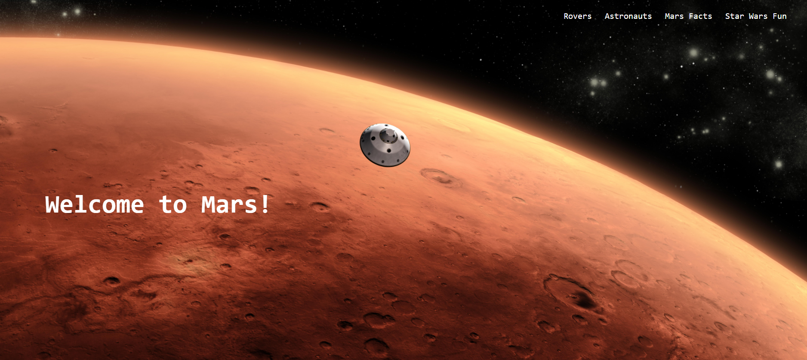

# astronomy-project

## Purpose

AS A space nerd, I WANT to view Mars rover images and other space facts on a single page, SO THAT I can learn and stay up to date about my favorite planet!

## Technologies
- HTML
- CSS
- JavaScript

With Bulma CSS Framework

Site data from the following APIs:
- NASA Open Innovation Team
- Open Notify
- SWAPI The Star Wars API

## Deployed at
https://kngurley25.github.io/astronomy-project/

## Image

## Contributors
- Gracalynn Cunningham
- Kristin Gurley
- Jeramy Sena